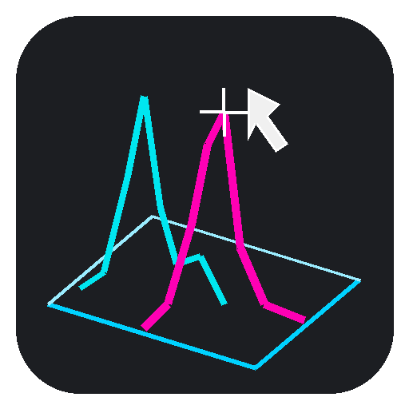

# Spikeless



Desktop GUI to clean single-point spikes from radio-HPLC spectra exported by **GINA X**,
produce publication-ready plots, and analyse/export them. MIT-licensed (see `LICENSE`).
*(The Python package is still named `spikeremover` internally.)*

## Run

Double-click **`Spikeless.bat`** (the launcher). On first run it downloads `uv`, installs a
private Python + dependencies under `C:\Users\Public\Spikeless` (no admin rights, no PATH
changes), drops a **Spikeless** shortcut (with the app icon) on your Desktop, then opens the GUI
with no console window. Later runs start immediately — use the Desktop shortcut.

To remove everything it installed, run **`uninstall.bat`** (deletes that one folder; your
project files and exports are untouched — Spikeless makes no PATH or registry changes).

## Use

1. **Drag** a GINA `.txt` onto the window (or **Browse…**). The spectrum plots immediately.
   Before any data is loaded there is no plot, and Plot options / Detect are disabled.
2. **Data** panel is a **tree**. Each **dataset** node is metadata only — name, file, run
   date/time, molecule, **radioisotope** (dropdown), and user-added **conditions** (Info, each a
   free note or a label/value pair). Under it sit **curves**: the **original**, and processed
   curves you create (spikeless, decay-corrected, …). Under each curve sit its results — a
   **spikes** group (→ each spike, showing y), a **baseline**, and a **peaks** group (→ each peak
   with **Rt / y / AUC / %**). Every node has a **checkbox** (unticking a parent unticks its
   children), can be **renamed** (double-click — a pen marks editable rows) and **removed** (✖).
   **Drag** curves/datasets to reorder them = change draw order (top of tree draws under, so later
   items sit on top — matters with alpha). Drop a dataset onto another dataset, or a curve onto a
   sibling curve, to reorder; a drop line shows where it will land. Buttons act on the selection:
   **Info** (details for *any* element — dataset metadata, curve, spikes, baseline, peaks, or a
   single spike/peak), **Adjust** (normalization, curve only), **Display…** (any node — appearance),
   **Duplicate** (curve).
3. **Processing** acts on the **selected curve** (so detecting on a spikeless curve finds no
   spikes). Pipeline order is **spikes → decay → baseline → peaks**: spikes are an electronic
   artefact unrelated to sample activity, so they are removed *before* decay correction; decay
   comes before baseline/peaks so AUC/% reflect the activity-corrected signal. Each action has a
   ⚙ for its parameters:
   - **Detect spikes** → marks spikes and adds a **spikeless** child curve (⚙: window, threshold,
     max width, interpolation linear / PCHIP).
   - **Apply decay** → adds a **decay-corrected** child curve. Its ⚙ sets the isotope (+ half-life)
     and the time to decay-correct **to** (default run start); if the isotope/half-life is missing
     when you click Apply decay, that dialog opens automatically. *(Hidden by default — enable it
     under Options → Processing features shown.)*
   - **Detect baseline** → adds a baseline (⚙: minimum / average of first N).
   - **Detect peaks** → adds peaks with Rt/AUC/% (⚙: prominence, height, distance, and the
     **local drift baseline** used for integration). Detection runs on a **spike-suppressed** copy
     of the curve, so spikes don't become skinny false peaks. Running it on a plain curve makes a
     fresh peaks group; running it on an existing peak/peaks group reprocesses with current options.
4. **Plot options** — a collapsible panel down the **left** side (closed by default; open it with
   its toolbar button). Sections: **Plot area**, **Margins**, **Legend**, **Y axis**, **X axis** —
   plot size in mm, plot-area/margin background colour + alpha, legend position/font, axis limits,
   fonts, tick length/thickness, and each axis's **Advanced** (title/label spacing, and a grid on
   major + minor). (Per-curve appearance is set from the Data tree via **Display…**.)
   Numeric axis limits, **graduation start/end**, and tick thickness have **Auto** tickboxes
   (auto tick thickness = axis thickness); a ticked Auto limit shows the value auto-mode would
   use, greyed out. Each axis has an **Advanced** sub-section (title↔label and label↔axis spacing,
   and a grid). All sections start collapsed except **Plot area**.
5. **Copy / Export / ⚙** live *per window*, not on a shared toolbar:
   - **Log** and **Report** carry **Copy · Export · ⚙ · ✕** on their **title bar**. The ⚙ holds
     that export's own options (log: include timestamps; report: copy tables as rich HTML). The
     **report** additionally shows a small **⧉ copy table** link next to *each* peak table in the
     text — click it to copy that one table (there can be several).
   - The **plot** has a **⧉ Copy · ⭳ Export · ⚙** cluster in the top-right of the graph area; its
     ⚙ sets PNG file dpi, **clipboard dpi** (default **600**), and clipboard format (PNG / SVG).
     Export writes PNG (default 600 dpi) or SVG at the exact mm size, transparency preserved. The
     report ⚙ also has **Export selected curve (GINA X)** — writes the processed signal back to a
     `.txt` in GINA format so it can be reloaded (best-effort GINA X compat).
6. **Options** — collapsible sections (all start collapsed): app **background** (checker/solid,
   cell size in plot **mm**), a dotted **export-area border**, **Plot view** (resolution-slider
   max), **Processing features shown** (tick which Processing buttons appear — Apply decay off by
   default), and **Menu windows** (which docks **open by default**, plus **lock menu windows**).
   These preferences persist between sessions.

The **Plot options / Data / Processing / Log / Report** toolbar buttons open and close their docks;
closing a dock un-presses its button, pressing it again reopens it.

### Plot navigation

The plot is rendered as a **vector** image you can zoom and pan: **mouse wheel** zooms centred
on the cursor, **drag** (any button) pans, **double-click** fits to the window. Drop a GINA
`.txt` straight onto it to load. The **resolution slider** (bottom-left) enlarges the plot area
1×–5× on screen (fonts/line widths stay fixed, so closely-spaced spikes/peaks separate out) —
tick **export** to apply it to exports too. The **⧉ Copy** button (top-right cluster) copies the
plot to the clipboard **at its real mm size** (the image carries its dpi, so pasting into
PowerPoint gives the Plot-options size, not a giant); clipboard dpi (default 600) is set in the
plot **⚙**.

### Adjust (decay correction & normalization)

Per-dataset and fully reversible (it never mutates the loaded data):

- **Decay correction** — corrects each sample back to a reference time using the isotope
  half-life. The half-life is auto-filled from a built-in table for the **Radioisotope** field
  (Lu-177, Ga-68, F-18, …) and can be overridden manually. Reference = run start (from the file
  header), an offset in minutes from start, or a clock time on the run date.
- **Normalization** — Counts (cps), **% of max**, or **% of total**. The `%` modes subtract a
  **baseline** first; baseline method is selectable (**Minimum**, **Average of first N points**;
  the estimator is a small registry so drift-aware / segmented methods can be added later).

## Spike detection algorithm

A spike is a single acquisition point whose value sits far above the local trend. Detection is a
**Hampel filter** (rolling median + median absolute deviation), which is *local*, so it flags a
spike even when it rides on a genuine chromatographic peak while leaving the multi-point peak
itself untouched. For signal `y` and window `w` (odd; default 7):

1. **Local reference** `med = median_filter(y, w)` (edges reflected).
2. **Local scale** from the residual: `mad_local = median_filter(|y − med|, w)`,
   converted to a robust standard deviation `σ = 1.4826 · mad_local`
   (1.4826 makes MAD ≈ σ for Gaussian noise).
3. **Two noise floors** keep quiet regions from over-flagging:
   - global floor: `σ = max(σ, 1.4826 · median(|y − med|))`, so a locally flat window whose
     `mad_local → 0` doesn't flag ~1-count wiggles;
   - Poisson floor (count data): `σ = max(σ, sqrt(max(med, 1)))`, the shot-noise scale of cps.
4. **Threshold**: a point is a candidate when `y − med > n_sigma · σ`
   (`n_sigma` default 5; `positive_only` flags only upward excursions — real spikes are high cps).
5. **Width guard**: any run of consecutive candidates longer than `max_width` (default 1) is
   *dropped*, because a wide excursion is a real peak, not a spike.

Parameters (**⚙** next to Detect): `window`, `n_sigma`, `max_width`.

## Spike removal (interpolation)

Flagged points are replaced by interpolation from their nearest un-flagged neighbours; all other
samples are left exactly as-is, so a point on a real peak's flank is restored to the local peak
level, not to baseline. If fewer than two clean points remain, the signal is left unchanged.
Method (Remove **⚙**):

- **Linear** (default) — a straight line between the nearest clean points (`numpy.interp`). For a
  single-point spike that is exactly `n-1 → n+1`. Cannot overshoot.
- **PCHIP** — monotone cubic interpolation across the gap. Smoother for multi-point gaps and,
  unlike a plain cubic spline, will not overshoot into ringing on a peak flank.

Detecting spikes never mutates the loaded data: it marks a **spikes** group on the curve and adds
a **spikeless** child curve, which you can further process (baseline, peaks, decay) like any other
curve. Show/hide, rename, or remove each node in the Data tree.

## Peaks (Rt, AUC, %)

**Detect peaks** on a curve finds local maxima (prominence-based) and computes, per peak,
**Rt** (apex x), **x start/end/width**, **y max** (above baseline), **AUC**, **%** of the group
total, and a **skewness**. Select a peak → **Info** shows all of it (name editable); **Display…**
sets the peaks group's style. Integration bounds run apex-to-valley (the low point between a peak
and its neighbour) then trim to the peak's feet, so the shaded region spans the whole peak rather
than a narrow tip. Peaks draw as a shaded **AUC fill** by default (or markers), with optional
on-graph **Rt / %** labels. The baseline used for integration is a **local drift line** between
each peak's bounds by default, or the curve's detected baseline — a **Detect peaks ⚙** option. The
**report** is the dataset metadata + conditions + a per-curve peak table; a **⧉ copy table** link
next to each table copies an HTML table you can paste straight into Word/PowerPoint.

## GINA format notes

- Windows-1252 encoded, tab-separated, decimal comma.
- Signal = 2nd column (radiodetector count rate, cps).
- The time column is display-formatted and lossy, so time is reconstructed assuming uniform
  sampling (interval inferred from the file; all known files are 1 Hz).

## Dev

```
uv run python -m spikeremover              # launch
uv run python -m spikeremover.spikes       # spike-detection self-check
uv run python -m spikeremover.peaks        # peak-detection self-check
uv run python -m spikeremover.adjust       # decay/baseline/normalization self-check
uv run python -m spikeremover.io_gina      # parser + GINA-save round-trip self-check
uv run python -m spikeremover.plotting     # plot-sizing self-check
```

## Roadmap (phase B)

Per-peak report table (area/height/retention) + Excel export, more baseline estimators
(drift-aware, segmented, asymmetric least squares), richer peak parameters.
